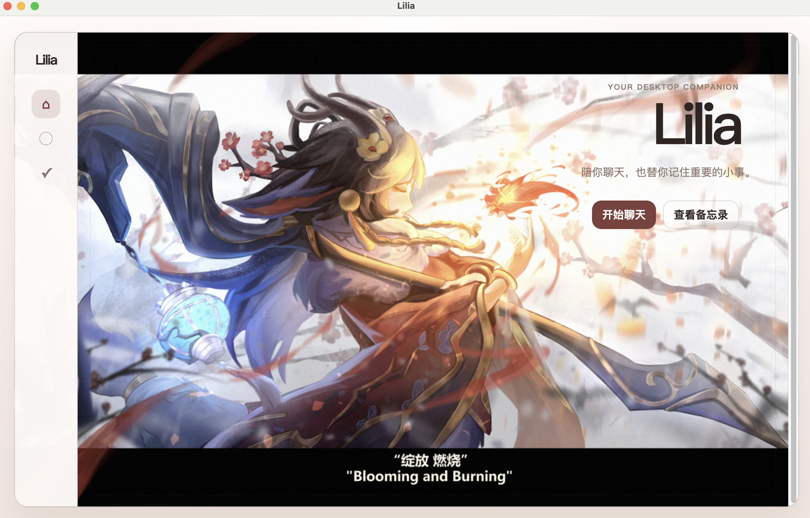

# Lilia

一个运行在本地的聊天与备忘录工具。Lilia 使用 Electron 提供桌面界面，使用 Express 处理聊天请求；聊天内容通过兼容 OpenAI 接口的服务生成，备忘录与聊天记录保存在用户自己的电脑中。



## 当前功能

- 本地桌面应用：使用 Electron 打开 Lilia。
- AI 聊天：可选择不同对话人格，通过 OpenAI 兼容接口获得回复。
- 聊天记录保存：关闭并重新打开应用后，历史对话会自动恢复。
- 备忘录：新建并查看正在记住的事项。
- 本地存储：备忘录使用 SQLite 保存；聊天记录保存为 JSON 文件。

> 目前备忘录还没有“到点提醒、完成或删除”的交互；这是后续可以继续实现的功能。

## 技术栈

- Electron：桌面窗口、主进程与安全的前端通信。
- Express：本地 HTTP 服务与聊天接口。
- Node.js：服务端逻辑、文件读写与 SQLite。
- SQLite：本地备忘录数据。
- OpenAI-compatible API：AI 回复能力。

## 环境要求

- Node.js 18 或更高版本
- npm

## 安装

在项目根目录执行：

```bash
npm install
```

## 配置 AI 服务

在项目根目录创建 `.env` 文件。可以先复制 `.env.example` 的内容，再填入自己的配置：

```env
PORT=3000
OPENAI_API_KEY=your_api_key_here
OPENAI_BASE_URL=https://your-provider.example/v1
OPENAI_MODEL=your_model_name_here
```

各项含义：

- `PORT`：本地 Express 服务端口，默认是 `3000`。
- `OPENAI_API_KEY`：AI 服务的密钥。
- `OPENAI_BASE_URL`：兼容 OpenAI API 的服务地址。
- `OPENAI_MODEL`：要调用的模型名称。

`.env` 已被 Git 忽略。请不要提交 API Key，也不要把它发送到公开仓库。

## 启动方式

需要先启动本地服务，再启动 Electron。请打开两个终端窗口。

终端 1：启动 Express 开发服务。

```bash
npm run dev
```

终端 2：启动桌面应用。

```bash
npm run electron:dev
```

如果只想在浏览器中调试网页界面，可以在服务启动后访问：

```text
http://localhost:3000
```

健康检查地址：

```text
http://localhost:3000/health
```

## 数据保存在哪里

Electron 会把用户数据放在系统的应用数据目录中，而不是项目文件夹内。

在 macOS 上，当前开发环境通常位于：

```text
~/Library/Application Support/web-pet-mvp/
```

其中包括：

- `conversation.json`：聊天记录。
- `lilia.db`：SQLite 备忘录数据库。

这些都是本地文件，不会自动上传到云端或 GitHub。

## 项目结构

```text
web-pet-mvp/
├── electron/
│   ├── main.js                    # Electron 主进程与 IPC 处理
│   ├── preload.js                 # 受控地向前端暴露桌面能力
│   └── storage/
│       ├── conversation-store.js  # 聊天记录读写
│       ├── database.js            # SQLite 数据库初始化
│       └── reminder-store.js      # 备忘录数据操作
├── public/
│   ├── index.html                 # 前端页面
│   ├── main.js                    # 前端交互与页面渲染
│   ├── styles.css                 # 页面样式
│   └── images/                    # 背景与保留的图片资源
├── src/
│   ├── ai/
│   │   └── openai-compatible.client.js  # AI 服务客户端
│   ├── config/                    # 环境变量与人格配置
│   ├── server/                    # Express 服务、路由和错误处理
│   └── services/
│       └── pet-chat.service.js    # 聊天业务逻辑
├── docs/images/                   # README 图片
├── .env.example                   # 环境变量模板
└── package.json
```

## 开发说明

- 当前项目将重点放在本地聊天、备忘录和 Electron 桌面应用能力上。
- 原有图片资源与状态机代码暂时保留，但当前主页不显示角色立绘。
- `node_modules`、`.env` 和用户数据目录不应提交到 Git。
